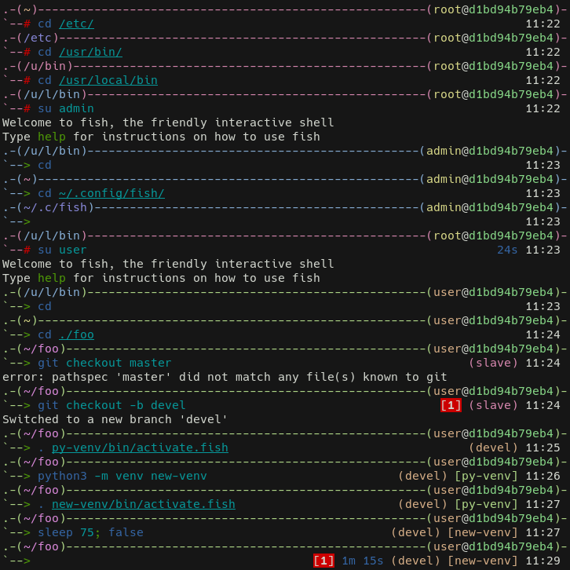

# HLine prompt for Fish shell

Fish re-implementation of the Adam2 shell prompt from zsh

This prompt can also generate unique (almost) colors for the current directory,
username, host, branch, virtual environment, and horizontal line.
The horizontal line color is generated from the username and hostname.



## Installation

### [Fisherman](https://github.com/fisherman/fisherman)

    fisher add akhilman/fish-prompt-hline

Then restart fish or call `source ~/.config/fish/conf.d/prompt_hline_init.fish`

## Configuration

```fish
# Setup some colorscheme in fish's web app
fish_config
```

Add following to your `config.fish` or somewhere in `.conf.d/`:

```fish
# Setup right prompt colors
set -g fish_color_duration blue
set -g fish_color_hline grey  # if not generated
set -g fish_color_njobs green
set -g fish_color_status --background red white
set -g fish_color_time white
set -g fish_color_vcs yellow  # if not generated
set -g fish_color_venv magenta  # if not generated

# Enable generated colors
set -g hline_generate_color_cwd 1
set -g hline_generate_color_hline 1
set -g hline_generate_color_host 1
set -g hline_generate_color_user 1
set -g hline_generate_color_vcs 1
set -g hline_generate_color_venv 1

# Adjust generated colors
set -g hline_generated_color_hue_offset 0  # 0 <= H <= 360
set -g hline_generated_color_saturation 25  # 0 <= S <= 100
set -g hline_generated_color_value 80  # 0 <= V <= 100
```
